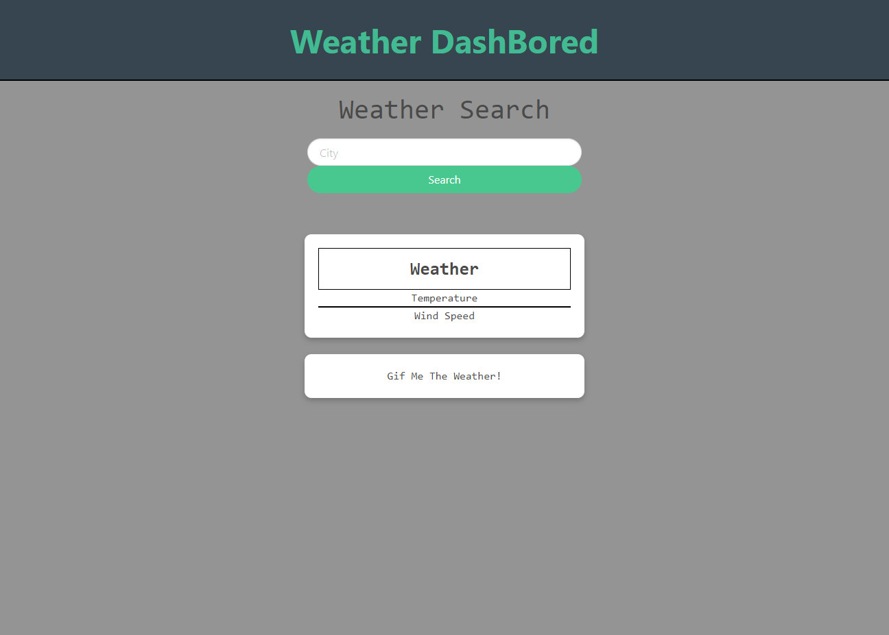

# Weather DashBored

## Table Of Content

- [Description](#Description)
- [Visuals](#Visuals)
- [Usage](#Usage)
- [Acknowledgment](#Authors)
- [Links](#Links)

### Description

We built this site using Api's, JS, Bulma, Css and Html. We thought of this idea from scratch and decided it would be fun to create a project like this.

### Visuals

### Usage

This site is used to add some fun to getting the weather. You put a city name in the search field then hit search. You will then be presented with the current temperature and wind speed. Along with a gif representation of the forcast such as, Sunny, Clear, Raining, etc. Made for information and entertainment. 

### Authors and acknowledgment
Thank you to our team work working hard and taking the time to work over time to finish this project. Special thanks to Matt, Jacob, and Austin

### Links

[Repo] (https://github.com/jacobotaylor/band-weather-app)
[WeatherDashBored] (https://jacobotaylor.github.io/band-weather-app/)